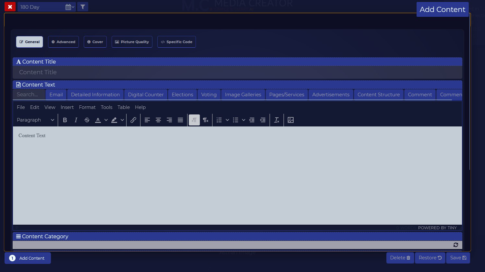

   
  <b>Online system and websites management</b> 
  <a href="https://astifan.online/?ct=nv3739">Read More</a>
    
    

I start working on this project since 2013

After 2 years of research and planning built the structure

Then started the main development

In 2020 it was ready

The project need more support to complete the last stage: 

- Templates management

- React Integration

- NodeJS Integration

This project can be more secure option than WordPress in the future

# Features

- Performance

- Security

- Statistics

- Mulit-Language

- Multi-Users

- Translation

- Interaction Tools

- Structure Tools

- Templates management

- Backup management

- API Tools

## Why it's not available

The project built to provide security

This project need to be built-in with secure hosting services provide this system as frontend

We can later publish lite version of the system for public use

# Credits

Developed by Bashar Astifan
